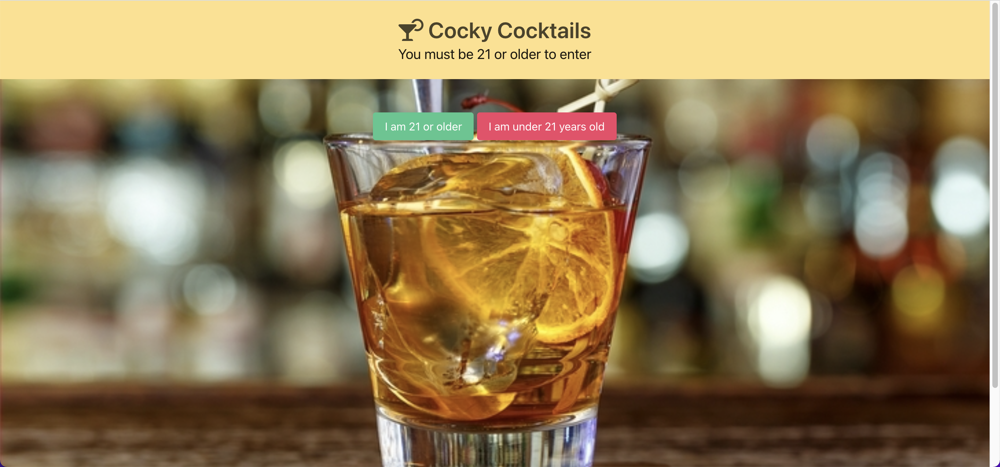

# cocktail-project
 Project 1 Team 3 Due : 26 Jan 2022

    For our group project, we decided to make "Cocky-Cocktails" an application that will generate cocktails from the various supplies the user has in their home at that time. 
    First, we generated a mockup of what we wanted our application to look like with Wireframe CC. After the group was in agreeance with the appearance, we started with hardcoding the UI with the Bulma. Learning a new framework in a short amount of time became a challenge at first, but as a group, we were able to discover how certain elements worked and how to configure them to our page. Once the site was hardcoded, Austin implemented the cocktail DB API to start sorting out liquors and ingredients. We applied this with the use of two dropdown menus. There are so many ingredients that pushed the dropdown into the footer. Johnathan configured the dropdowns into a scrollable element for a more polished UI. After the user chooses their ingredients, the user will be prompted to the next page with the use of a button. This page lists the cocktail name accompanied by a picture of the drink for the user to choose. Once the user has their drink of choice, they are brought to the final page where they will view the mixing instructions. The user will also be able to watch an instructional Youtube video without leaving the site. Johnathan and Austin accomplished with the Youtube API and embedding the video onto the page. The Youtube API can filter videos with the user's drink of choice, so they do not receive random meaningless videos from the web. 
    This project was a significant step forward in becoming a full-stack developer. It showed us how to implement documentation to learn new technologies, and it helped us work in a streamlined fashion using Github. Mostly, it showed us how to work together as a team by communicating and having a positive mindset to complete tasks in a time-efficient manner.

    Thank you,
    Ryan DeShazo
    Johnathan Reese
    Austin Hague

## Github Repo Link : https://github.com/whosshazo/cocktail-project

## Webpage Link : https://whosshazo.github.io/cocktail-project/

## Screenshot Below :

---
## Grading Criteria :
---
#### AS AN: cocktail connoisseur and aspiring bartender
#### I WANT: an application to tell me based on my avaiable supplies the cocktails I can make
#### SO THAT: I can impress my friends without going to the store or spending more money
#### WHEN: Presented with a new cocktail I do not know how to make 
#### THEN: I am able to watch a Youtube video on how to make that cocktail
 
---
### API's to use :
#### Cocktail DB API : https://www.thecocktaildb.com/api.php
#### Youtube video API : https://rapidapi.com/apilovercom/api/youtube-videos/
---

 